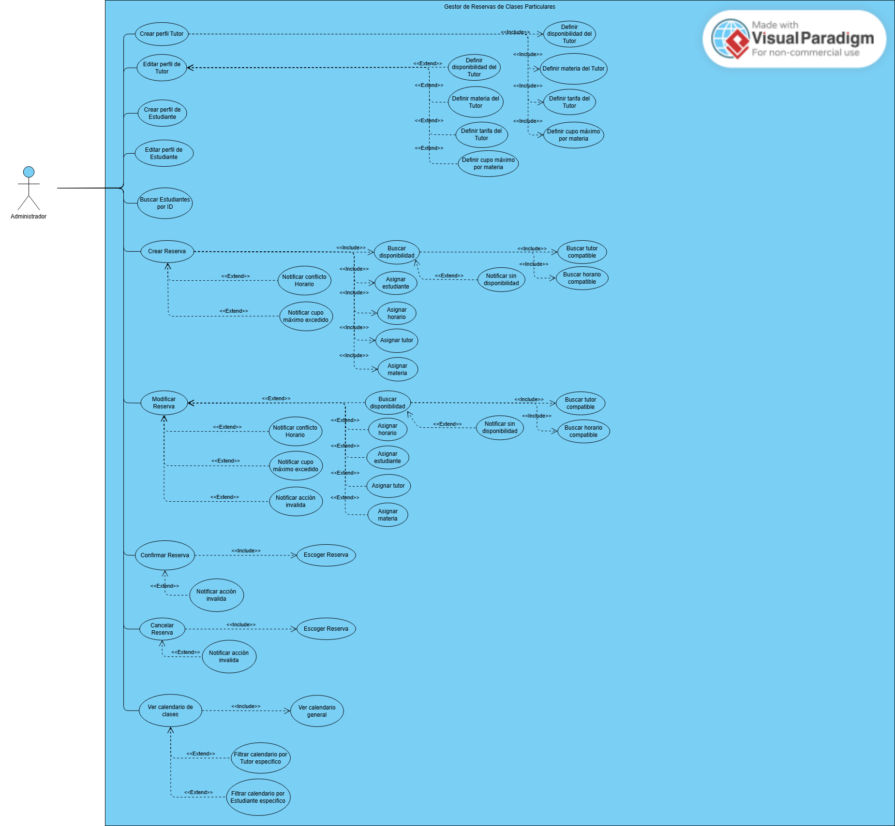
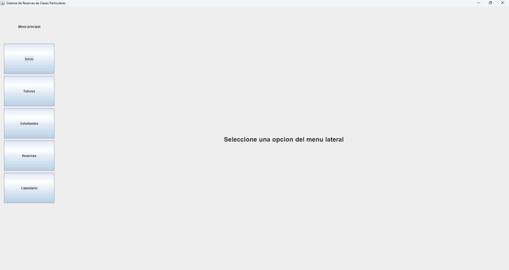
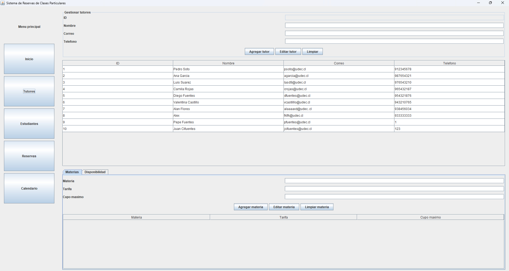
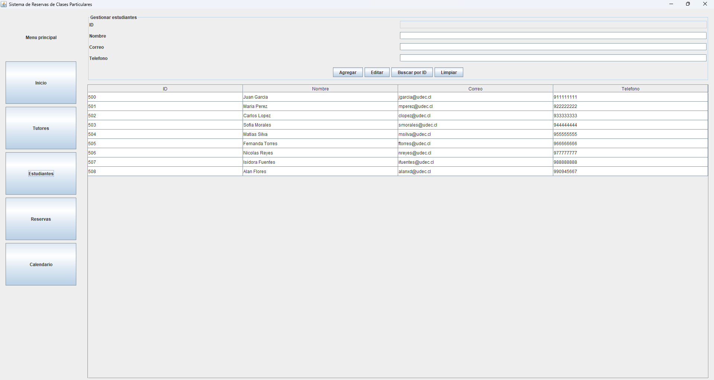
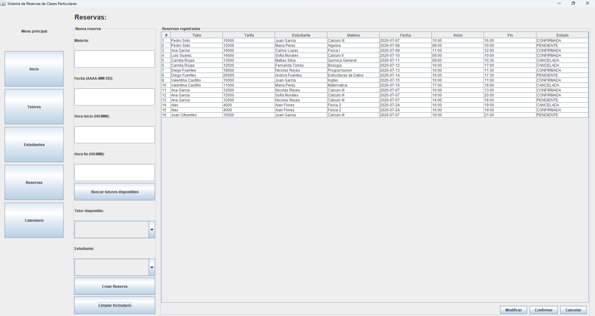
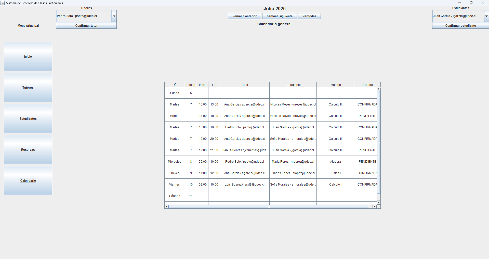

# Proyecto Final: Sistema de Reservas de clases particular

## Integrantes Grupo 10

- Agustin Andres Baeza Mansilla
- Alan Ignacio Flores Yerey
- Ignacio Esteban Placencia Palma

## Enunciado: Tema 3, Sistema de Reservas de clases particular (Referente: Marcos Martínez)

Este sistema está diseñado como una herramienta interna para que un administrador gestione eficientemente las reservas de clases particulares o tutorías. El administrador podrá crear y mantener perfiles detallados de los tutores, incluyendo las materias que imparten, sus tarifas, la cantidad máxima de estudiante por materias y, sus bloques de horarios de disponibilidad. De igual forma, el administrador registrará y gestionará la información de los estudiantes que solicitan el servicio. Cuando se reciba una solicitud de clase el administrador utilizará el sistema para buscar horarios y tutores compatibles con las necesidades del estudiante. Una vez encontrada una opción adecuada, el administrador creará la reserva directamente en el sistema, asignando al estudiante con el tutor en el horario específico. El sistema deberá prevenir conflictos horarios y mantener un "calendario" de las clases programadas con vistas filtradas para cada tutor u estudiante.  Además, el administrador se encargará de procesar modificaciones o cancelaciones de clases.

--- 

## Diagrama de casos de uso

## Capturas de pantalla de la interfaz

### Panel Principal

### Panel de Tutores

### Panel de Estudiantes

### Panel de Reservas

### Panel de Calendario

## Diagrama de clases UML

---

## Patrones de diseño implementados

Durante el desarrollo del proyecto se implementaron patrones de diseño con el objetivo de mejorar la organización del código, evitar lógica repetitiva y mantener una separación clara de responsabilidades. Los patrones principales utilizados fueron State y Builder. Además, el sistema se organizó siguiendo una estructura cercana a MVC, separando la interfaz gráfica, el controlador y la lógica del sistema.

### Patrón State

El patrón State se aplicó sobre la clase Reserva, ya que su comportamiento varía dependiendo del estado en que se encuentre: pendiente, confirmada o cancelada. Esta decisión surgió porque las acciones disponibles sobre una reserva no son siempre las mismas.

Inicialmente se evaluó representar los estados únicamente mediante un enum, pero esta solución fue descartada porque habría obligado a concentrar la lógica de comportamiento dentro de la clase Reserva mediante múltiples condicionales if/else. Esto habría generado una clase más extensa, menos flexible y más difícil de mantener.

La solución final fue definir una interfaz de estado y distintas clases concretas para representar cada estado posible. De esta manera, cada estado encapsula su propio comportamiento y decide qué acciones son válidas o inválidas. La clase Reserva delega estas decisiones al objeto de estado que mantiene internamente, reduciendo el acoplamiento y facilitando futuras extensiones.

Clases utilizadas en este patrón:

- Reserva: Es la clase que representa una reserva del sistema y mantiene internamente una referencia a su estado actual. No decide directamente qué acciones son válidas, sino que delega ese comportamiento al estado correspondiente.
- StateReserva: Es la interfaz común que define las operaciones que dependen del estado de una reserva, tales como confirmar, cancelar o validar modificación.
- StatePendiente: Representa el estado pendiente de una reserva. Desde este estado se permite confirmar o cancelar la reserva, ya que aún no se encuentra finalizada.
- StateConfirmada: Representa el estado confirmado de una reserva. En este estado la reserva ya fue aceptada, por lo que algunas acciones cambian respecto al estado pendiente.
- StateCancelada: Representa el estado cancelado de una reserva. Este estado restringe nuevas acciones sobre la reserva, evitando que una reserva cancelada pueda confirmarse o modificarse posteriormente.

### Patrón Builder

El patrón Builder se aplicó sobre la clase Tutor a través de la clase TutorBuilder debido a la variabilidad que poseen las materias y disponibilidades a la hora de ser ingresadas para crear un tutor en su constructor. Dado lo anterior, construir un tutor mediante un constructor tradicional con todos estos elementos habría sido poco práctico, por esto, se decidió utilizar un builder que permitiera construir el objeto paso a paso.

TutorBuilder expone métodos encadenables como conDatosBasicos, agregarMateria y agregarDisponibilidad, permitiendo construir un tutor de forma progresiva y más legible. Finalmente, el método build finaliza la construcción del tutor.

Clases utilizadas en este patrón:

- Tutor: Es el objeto complejo que se desea construir. Representa a un tutor del sistema, incluyendo sus datos personales, materias y disponibilidades.

- TutorBuilder: Es la clase encargada de construir progresivamente un objeto Tutor. Entrega métodos como conDatosBasicos, agregarMateria, agregarDisponibilidad y build.
- MateriaTutor: Representa una materia asociada al tutor, incluyendo datos como nombre de la materia, tarifa y cupo máximo.
- DisponibilidadTutor: Representa un bloque de disponibilidad horaria asociado al tutor, indicando fecha, hora de inicio y hora de término.

Se evaluó aplicar el mismo patrón a Estudiante, pero se descartó porque su construcción no presenta la misma complejidad. Un estudiante solo requiere datos básicos obligatorios, por lo que aplicar Builder en ese caso habría sido un uso innecesario y excesivo del patrón.

### Separación Modelo-Vista-Controlador

Respecto a la arquitectura del sistema, se tomó la decisión de organizarlo siguiendo una separación MVC. Esta estructura permite que la interfaz gráfica no manipule directamente las clases de la lógica, sino que realice sus solicitudes a través de SistemaReservasControlador.

La Vista está compuesta por los paneles gráficos del sistema, como PanelTutores, PanelEstudiantes, PanelReservas y PanelCalendario. El Controlador se implementa en SistemaReservasControlador, que valida las solicitudes recibidas desde la interfaz y las delega hacia las clases correspondientes de la lógica. Finalmente, el Modelo está compuesto por las clases encargadas de representar y gestionar tutores, estudiantes, reservas, materias, disponibilidades y estados de reserva.

Clases y roles dentro de la separación MVC:

Modelo:

- Tutor, MateriaTutor y DisponibilidadTutor: Representan la información asociada a los tutores del sistema.

- Estudiante: Representa a los estudiantes registrados en el sistema.

- Reserva: Representa una reserva de clase particular entre un tutor y un estudiante.

- GestionarTutores: Administra la creación, edición y búsqueda de tutores.

- GestionarEstudiantes: Administra la creación, edición y búsqueda de estudiantes.

- GestorReservas: Administra la creación, modificación, cancelación y consulta de reservas.

- BuscadorDisponibilidad: Se encarga de validar disponibilidad, conflictos horarios y compatibilidad entre tutor, materia y horario.
  
- CargadoGuardadoTutor: Se encarga de guardar y cargar los tutores, junto con sus materias y disponibilidades, desde un archivo de texto.
  
- CargadoGuardadoEstudiante: Se encarga de guardar y cargar los estudiantes desde un archivo de texto.
  
- CargadoGuardadoReserva: Se encarga de guardar y cargar las reservas registradas, manteniendo también su estado.

Vista:

- Ventana: Representa la ventana principal del sistema.

- PanelPrincipal: Contiene la estructura principal de la interfaz y administra el cambio entre paneles mediante CardLayout.

- PanelMenu: Permite navegar entre las distintas secciones del sistema.

- PanelInicio: Muestra la pantalla inicial del sistema.

- PanelTutores: Permite gestionar tutores, materias y disponibilidades desde la interfaz gráfica.

- PanelEstudiantes: Permite gestionar estudiantes desde la interfaz gráfica.

- PanelReservas: Permite crear, modificar, confirmar y cancelar reservas.

- PanelCalendario: Permite visualizar las reservas en formato semanal y filtrarlas por tutor o estudiante.

Controlador:

- SistemaReservasControlador: Recibe las solicitudes de la interfaz gráfica, valida los datos ingresados y delega las operaciones hacia las clases de la lógica.

---

## Decisiones importantes tomadas durante el proyecto

Durante el desarrollo del proyecto se tomaron distintas decisiones de diseño orientadas a mantener el sistema simple de utilizar, pero suficientemente completo para cubrir la temática de reservas de clases particulares.

### Uso de identificadores para tutores y estudiantes

Se decidió asignar identificadores numéricos a tutores y estudiantes. Esta decisión permite buscar y editar registros de forma más precisa, evitando depender únicamente de nombres o correos. Esto es importante porque pueden existir personas con nombres iguales, o incluso datos repetidos ingresados por error.

Los tutores y estudiantes son creados por el sistema con un ID propio, lo que facilita su selección y reduce ambigüedades dentro de la interfaz, ademas de un manejo preciso dentro de la logica del sistema.

### Prevención de materias duplicadas en un tutor

Como un tutor puede impartir varias materias, se agregó una validación para evitar que una misma materia sea registrada más de una vez para el mismo tutor. Esta decisión evita duplicidad de información, inconsistencias en tarifas y problemas al momento de buscar tutores compatibles para una reserva.

### Validación de disponibilidad y conflictos horarios

Para esto se utilizó BuscadorDisponibilidad, encargado de verificar si un tutor tiene disponibilidad en un bloque horario y si existe conflicto con reservas ya registradas.

Esto permite que la creación y modificación de reservas no dependan solo de la interfaz gráfica, sino de una validación centralizada en la lógica del programa. De esta forma, aunque el usuario intente crear o modificar una reserva con datos incorrectos, el sistema valida nuevamente antes de aceptar la operación.

### Uso de CardLayout en la interfaz gráfica

Para la interfaz gráfica se evaluó inicialmente trabajar con múltiples ventanas, pero se descartó esta opción porque habría hecho la navegación más incómoda y desordenada. En su lugar, se implementó una ventana principal con un menú lateral y cambio de paneles mediante CardLayout.

Esta decisión permitió que el administrador acceda a las secciones principales del sistema de forma directa, sin abrir ni cerrar ventanas constantemente.

### Uso de enum para los paneles del sistema

Se implementó la enumeración PanelSistema para representar las secciones principales de la interfaz gráfica. Cada valor del enum contiene el identificador utilizado por CardLayout para mostrar el panel correspondiente.

### Sistema de guardado y cargado de datos

Aunque el foco principal del proyecto era la lógica de reservas y la interfaz gráfica, se incorporó guardado y carga de datos para tutores, estudiantes y reservas. Esta decisión permite que la información registrada no se pierda al cerrar el programa, haciendo que el sistema sea más útil y cercano a una aplicación real.

El guardado se realiza después de operaciones importantes como crear, editar, confirmar, cancelar o modificar reservas, además de la carga inicial al iniciar el sistema.

---

## Problemas identificados y autocrítica

Durante el desarrollo del proyecto se identificaron distintos problemas técnicos y de organización que obligaron al equipo a tomar decisiones y ajustar la implementación.

### Complejidad de la modificación de reservas

Uno de los problemas más relevantes fue definir correctamente qué significaba modificar una reserva. Al inicio, esta funcionalidad podía interpretarse solamente como cambiar el tutor o el estudiante asignado. Sin embargo, al analizar mejor el comportamiento esperado del sistema, se concluyó que una reserva también depende de la materia, la fecha y el bloque horario.

### Manejo de conflictos horarios

Otro problema importante fue evitar conflictos de horario sin generar falsos positivos. En particular, al modificar una reserva existente, el sistema podía detectar como conflicto la misma reserva que se estaba editando. Para resolver esto, se ajustó la lógica de modificación de reservas para evitar que la reserva actual fuese considerada como un choque consigo misma.

### Coordinación y regularidad del trabajo

Durante el proyecto fue necesario coordinar distintas partes del sistema, como la lógica, la interfaz gráfica, los patrones de diseño, las pruebas y la documentación. Esto exigió mantener coherencia entre lo que cada integrante desarrollaba.

Como autocrítica general, algunas decisiones de diseño se consideraron e implementaron cuando el proyecto ya estaba avanzado, si bien esto da de cierto punto flexibilidad a la hora de afrontar problemas, tambien evidencia una base debil en lo que es la planificación inicial de un proyecto estos ajustes posteriores. Para futuros proyectos, sería ideal definir con mayor precisión desde el inicio las responsabilidades de cada clase, el alcance exacto de cada funcionalidad y los patrones que han de ser necesarios.
